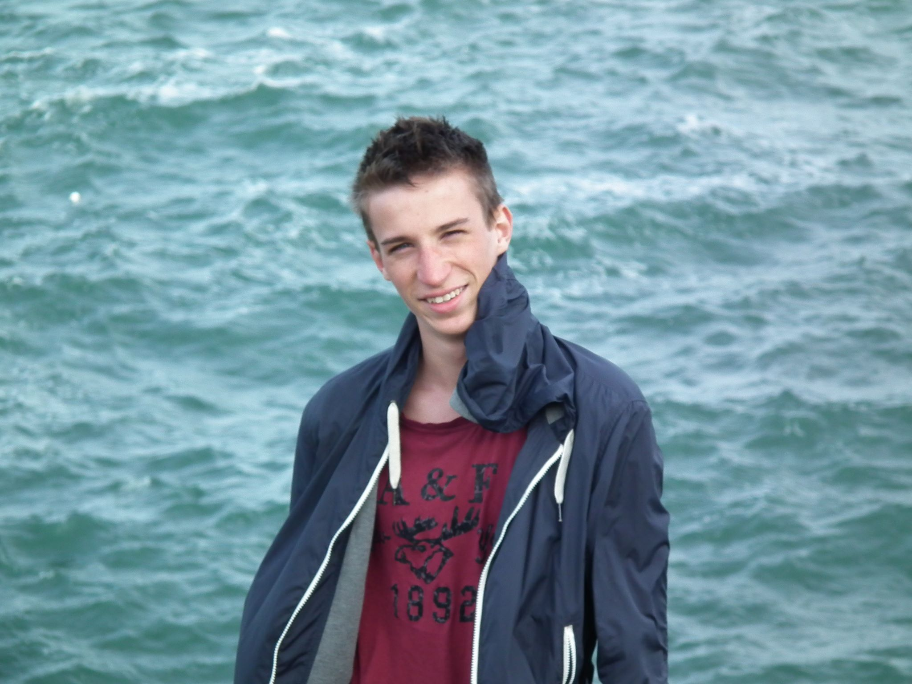
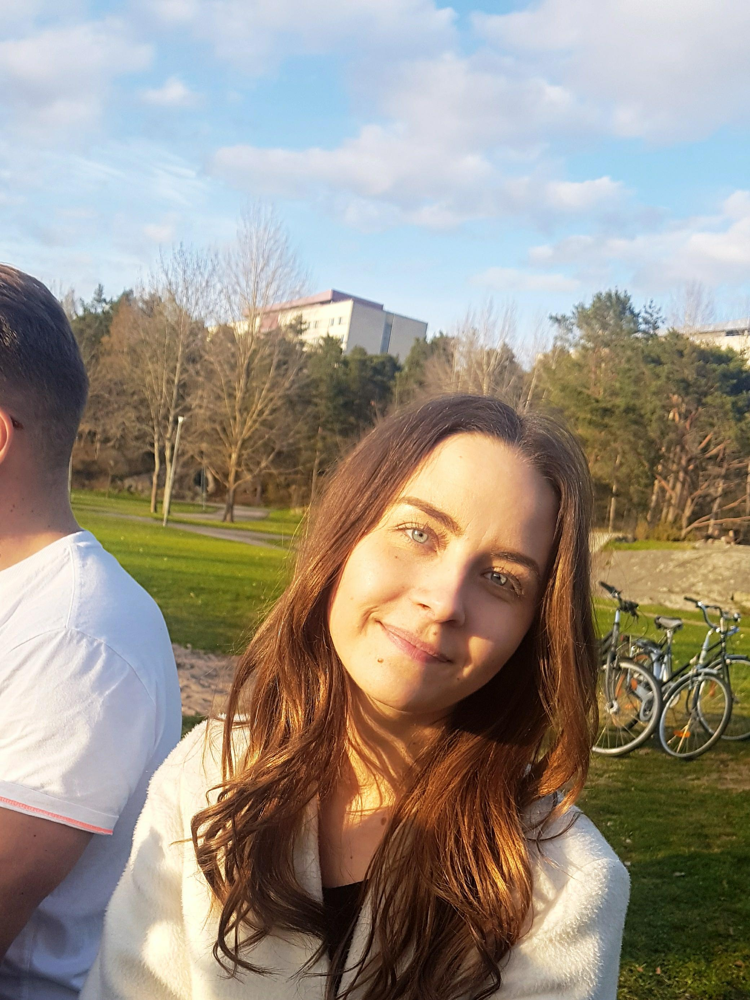
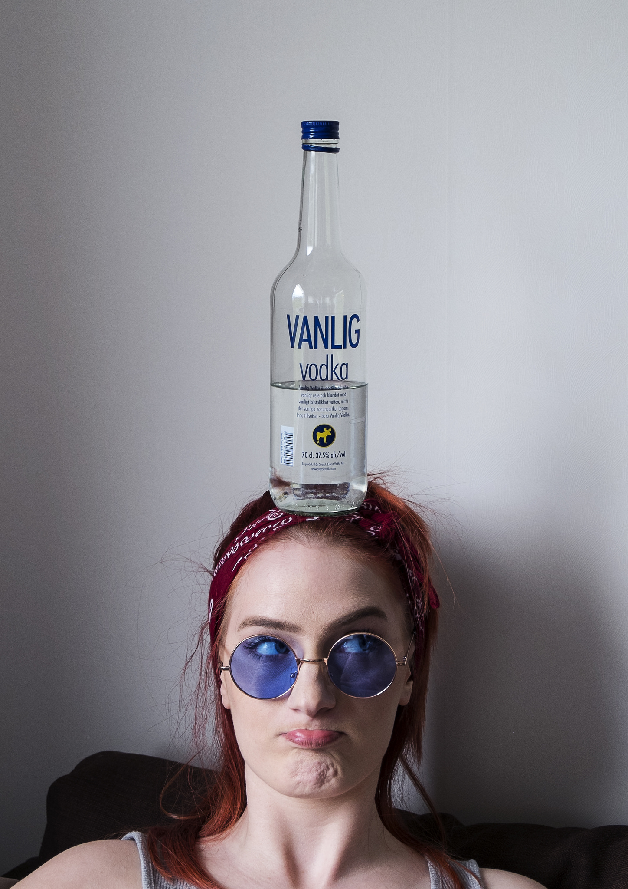
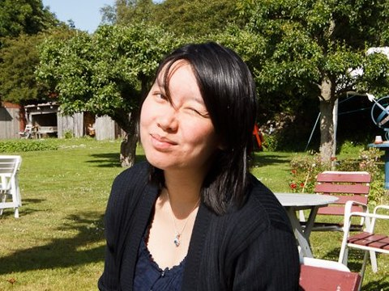
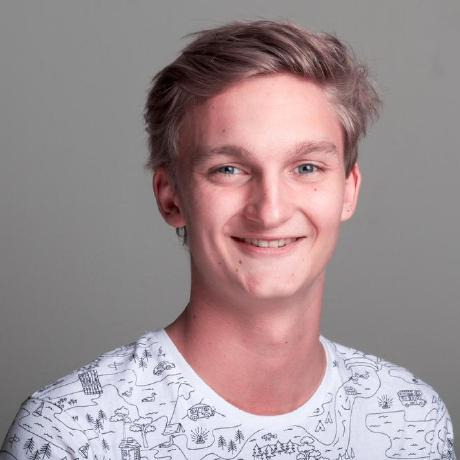

# Medlemmar
## EI-EMACS

OSPP (1DT096) 2018 - Projekt gamma

Bild                                     | Förnamn                     | Efternamn | Personnummer | Användarnamn (GitHub)
-----------------------------------------|-----------------------------|-----------|--------------|----------------------
 | [Alfred](#Alfred-Lindholm) | Lindholm | 951025-1912  | `madaraka`
 | [Christoffer](#Christoffer-Falkoven) | Falkoven | 940521-5311  | `christofferfalkoven`
 | [Emma](#emma-nilsson) | Nilsson | 960910-5342  | `emni4510`
 | [Ilda](#ilda-mehic) | Mehic | 960904-9623  | `ildaam`
 | [Man Dan](#man-dan-ly) | Ly | 810513-1604  | `maly6600`
 | [Sebastian](#sebastian-lhådö) | Lhådö | 950907-3616  | `miniskurken`

## Alfred Lindholm

### Okänd talang
Riktigt duktig på att snatta godis och att palla äpplen från min granne Stefan. Har också varit väldigt nära på att lösa en Rubix Kub.

### Starka sidor
Under projektet tror jag att jag kommer ha lättast att bidra med:
Kodgranskning, Hitta bugg samt komma på creativa lösningar till problem

 Skapa en lista med kortfattad beskrivning över områden där du tror du har lättast att
 bidra till projektet, till exempel:

- Agila Metoder
- problemlösning och algoritmer
- skriva kod utifrån färdig specifikation
- ledarskap
- rapport
- muntlig presentation

## Christoffer Falkoven

### Okänd talang
Jag kallas oftast "party-trick-kungen" och har massa skojiga talanger, bla kan trycka in mina ögon i skallen. Sen gillar jag att träna, tävlar i styrkelyft, lift the pain away som jag brukar säga. 

### Starka sidor
Mina lår.

Under projektet tror jag att jag kommer ha lättast att bidra med:
Funktionell styrka, sen är jag bra på frontend programmering samt att jag gärna lägger ned de timmar som behövs.

 Skapa en lista med kortfattad beskrivning över områden där du tror du har lättast att
 bidra till projektet, till exempel:

- analys/design/specifikation
- problemlösning och algoritmer
- skriva kod utifrån färdig specifikation
- ledarskap
- rapportskrivande
- muntlig presentation

### Personlig utveckling

Under projektet hoppas jag förutom att bli ännu bättre på mina redan
starka sidor även ges möjlighet att utveckla följande färdigheter,
till exempel:

- problemlösning och algoritmer
- planering
- samarbete
- ledarskap
- dokumentation
- kommunikation mellan olika moduler
- webservrar

## Emma Nilsson

### Okänd talang

När jag inte studerar tycker jag om att spela badminton och att resa

### Starka sidor

Under projektet tror jag att jag kommer ha lättast att bidra med:

- samarbete
- research (söka och sammanställa information)
- dokumentation
- rapportskrivande
- frontend

### Personlig utveckling

Under projektet hoppas jag förutom att bli ännu bättre på mina redan
starka sidor även ges möjlighet att utveckla följande färdigheter,
till exempel:

- analys/design/specifikation
- problemlösning och algoritmer
- skriva kod utifrån färdig specifikation
- muntlig presentation

## Ilda Mehić

### Okänd talang

In my free time I like to go out and party, and I also like to go to the gym. My secret talent is being able to chug a bottle of vodka and still walk normally. One of my other talents is watching netflix and chilling. 

### Starka sidor

Under projektet tror jag att jag kommer ha lättast att bidra med:

- planering
- research (söka och sammanställa information)
- dokumentation
- rapportskrivande
- frontend development

### Personlig utveckling

Under projektet hoppas jag förutom att bli ännu bättre på mina redan
starka sidor även ges möjlighet att utveckla följande färdigheter,
till exempel:

- analys/design/specifikation
- problemlösning och algoritmer
- skriva kod utifrån färdig specifikation
- samarbete

## Man Dan Ly

### Okänd talang

Läsa, träna, äta

### Starka sidor

Under projektet tror jag att jag kommer ha lättast att bidra med:

- planering
- samarbete
- ledarskap
- research (söka och sammanställa information)
- dokumentation
- rapportskrivande
- muntlig presentation

### Personlig utveckling

Under projektet hoppas jag förutom att bli ännu bättre på mina redan
starka sidor även ges möjlighet att utveckla följande färdigheter,
till exempel:

- analys/design/specifikation
- problemlösning och algoritmer
- skriva kod utifrån färdig specifikation

## Sebastian Lhådö

### Okänd talang

På den fritid vi har vid sidan om studier gillar jag att åka snowboard / longboard om vädret är fint! Har vi lite sämre väder blir det ofta att jag leker runt med grafisk design i bla. photoshop / illustrator.

### Starka sidor

Under projektet tror jag att jag kommer ha lättast att bidra med:

- Skriva kod utifrån färdig specifikation
- Problemlösning och algoritmer
- Analys/design
- Skriva Unit tests
- Dokumentation av functioner

### Personlig utveckling

Under projektet hoppas jag förutom att bli ännu bättre på mina redan
starka sidor även ges möjlighet att utveckla följande färdigheter,
till exempel:

- planering
- samarbete
- research (söka och sammanställa information)
- rapportskrivande
- muntlig presentation
